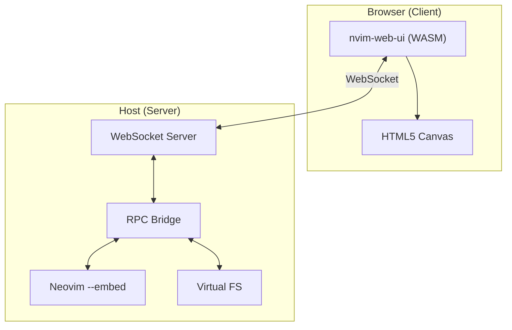
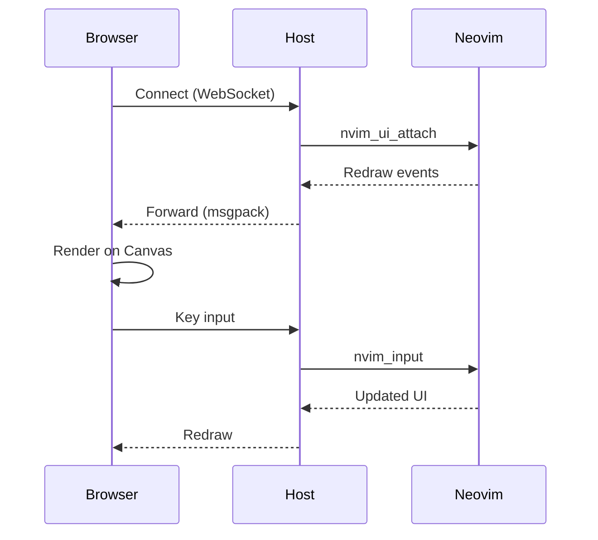
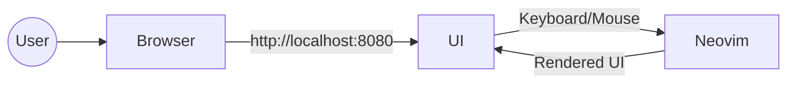
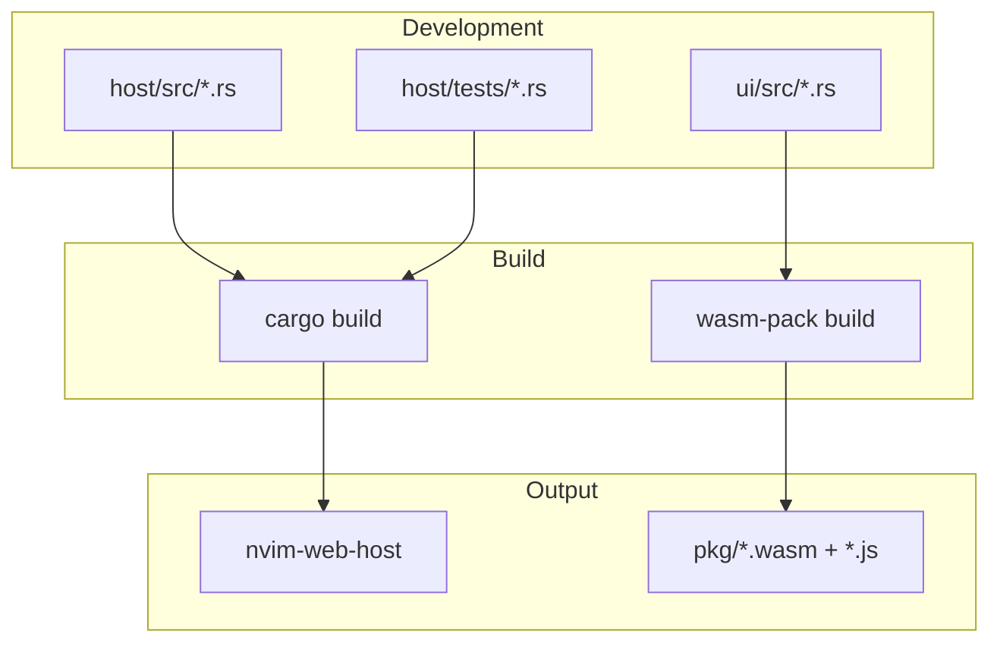
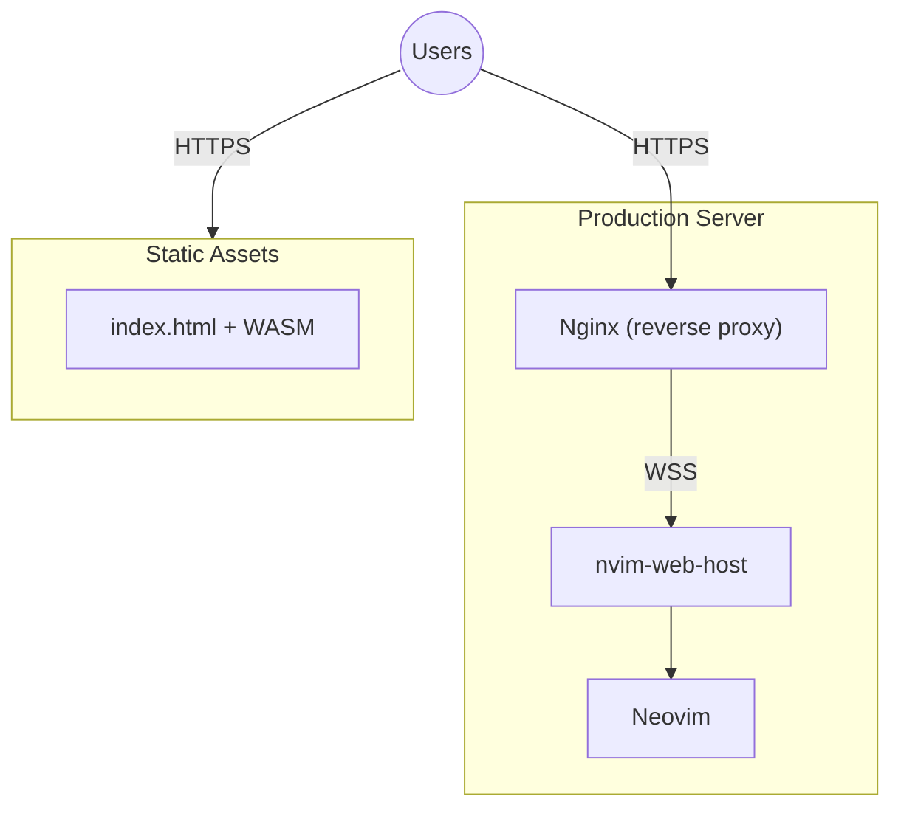
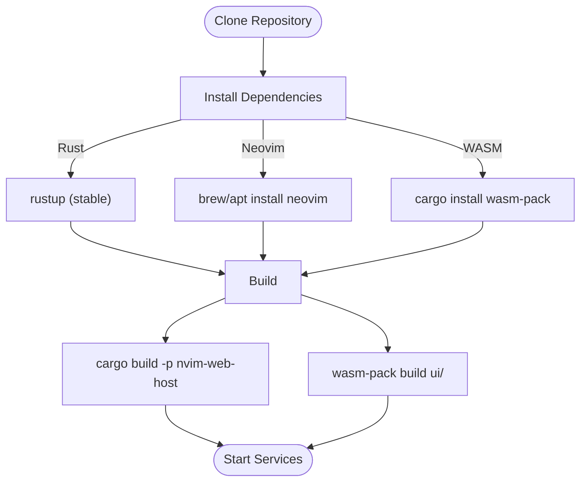

# nvim-web

Run Neovim in your browser. A WebSocket-based bridge that connects a native Neovim instance to a browser-based WASM UI.

## Overview

nvim-web enables full Neovim functionality in any modern browser by:

- Running Neovim natively on the server via `--embed` mode
- Bridging Neovim's RPC protocol over WebSocket
- Rendering the UI in the browser using Rust/WASM and Canvas

## Architecture



### Data Flow



## Components

| Component | Path | Description |
|-----------|------|-------------|
| **nvim-web-host** | `host/` | Rust binary that spawns Neovim and serves WebSocket |
| **nvim-web-ui** | `ui/` | Rust WASM library that renders Neovim UI in browser |
| **Documentation** | `docs/` | Protocol specs, testing guides, architecture notes |

## Quick Start

### Prerequisites

- Rust (stable)
- Neovim 0.9+
- wasm-pack

### Build

```bash
# Build the host
cd host
cargo build --release

# Build the WASM UI  
cd ui
wasm-pack build --target web
```

### Run

```bash
# Terminal 1: Start the host
./host/target/release/nvim-web-host

# Terminal 2: Serve the UI
cd ui && python3 -m http.server 8080

# Open browser
open http://localhost:8080
```

## Architecture Perspectives

### User Perspective



Users interact with Neovim through their browser. All keyboard shortcuts, visual modes, and plugins work as expected.

### Developer Perspective



### Production Deployment



### Installation Flow



## Project Structure

```
nvim-web/
  host/                 # Rust WebSocket server + Neovim bridge
    src/
      main.rs           # Entry point
      ws.rs             # WebSocket handling
      rpc.rs            # Neovim RPC protocol
      nvim.rs           # Neovim process management
      vfs/              # Virtual filesystem backends
    tests/              # Integration tests
  ui/                   # Rust WASM client
    src/
      lib.rs            # WASM entry point + event handling
      renderer.rs       # Canvas rendering
      grid.rs           # Grid state management
      highlight.rs      # Syntax highlighting
    index.html          # HTML entry point
  docs/                 # Documentation
  .github/workflows/    # CI configuration
```

## Features

- Full Neovim UI rendering
- Keyboard input with modifiers (Ctrl, Shift, Alt, Cmd)
- Mouse support (click-to-position, scroll)
- Syntax highlighting
- HiDPI/Retina display support
- Auto-reconnection on page refresh
- Virtual filesystem for browser-based file access

## Contributing

1. Fork the repository
2. Create a feature branch
3. Run tests: `cd host && cargo test`
4. Submit a pull request

## License

MIT

## Acknowledgments

- Neovim team for the excellent `--embed` mode and RPC API
- wasm-pack and wasm-bindgen for the Rust-WASM toolchain
