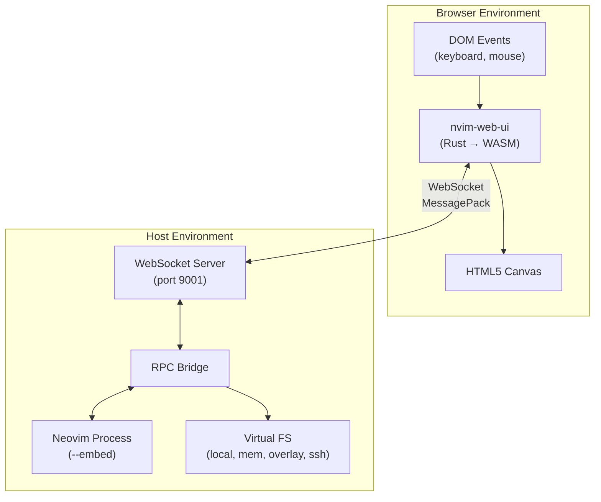
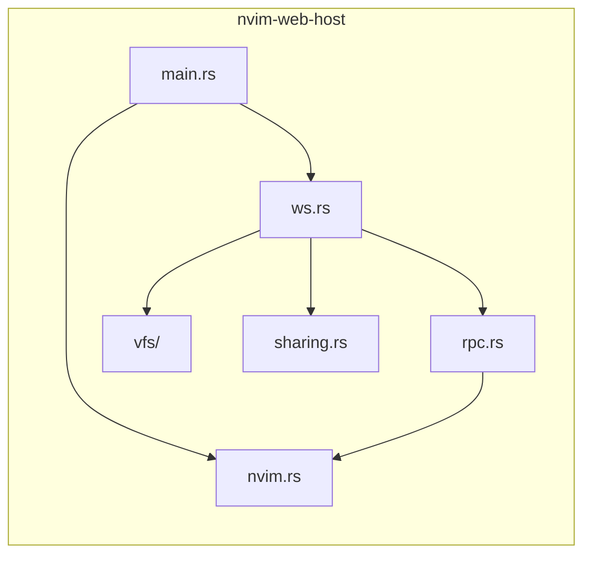
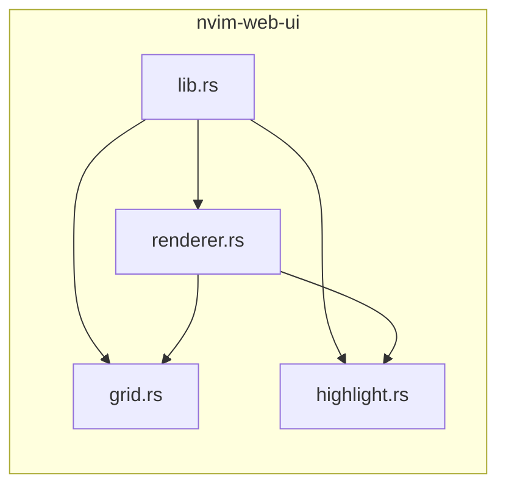
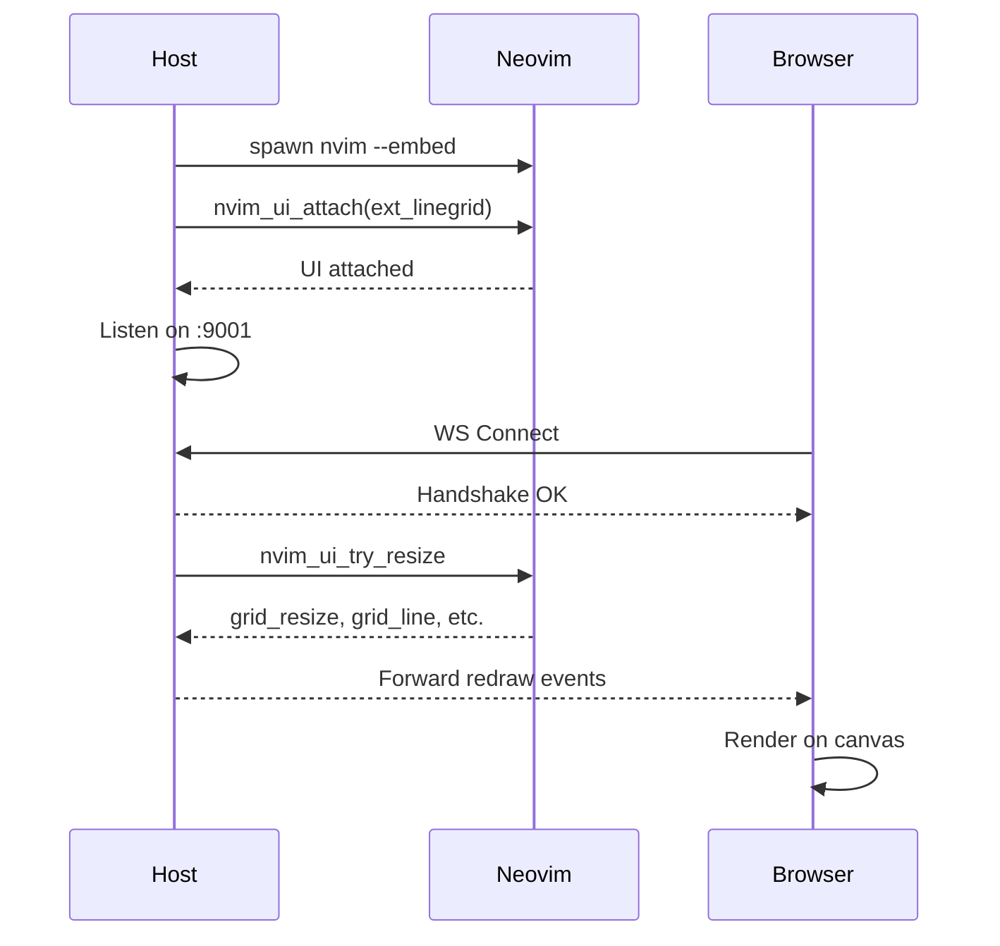
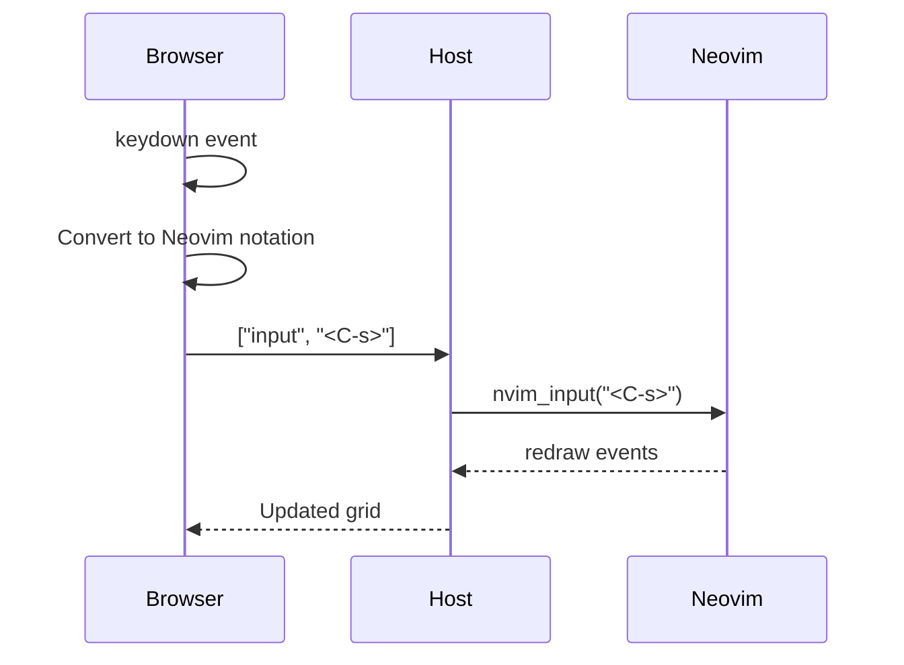
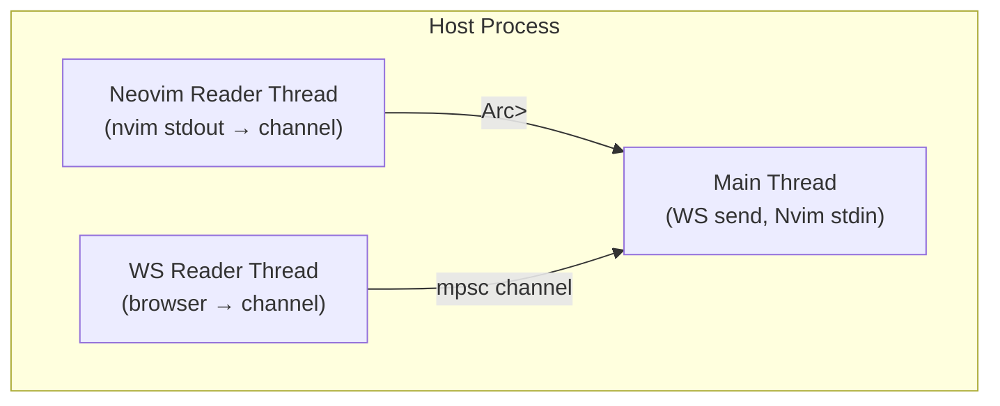
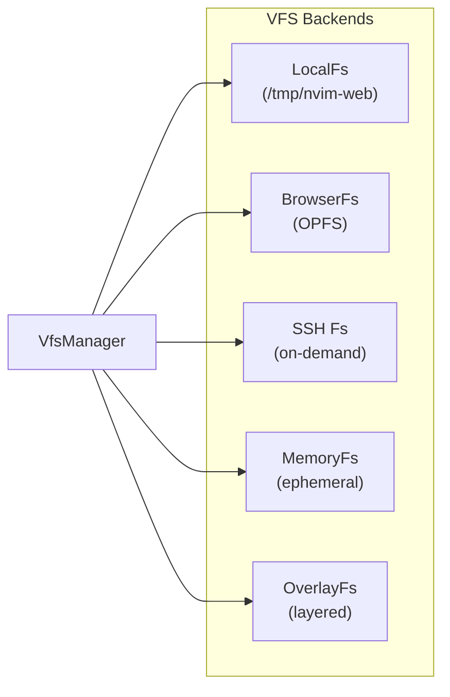
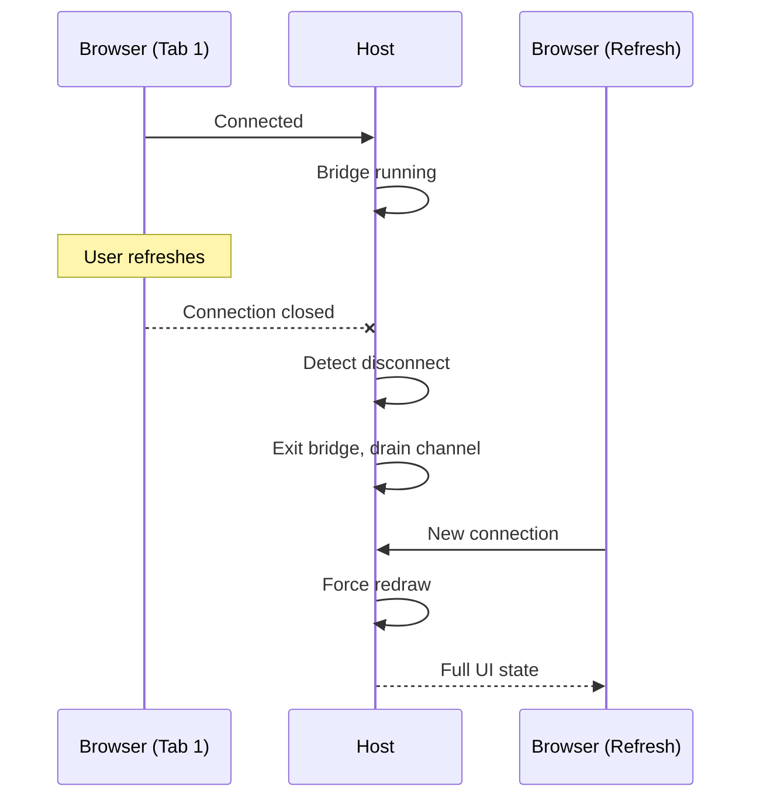
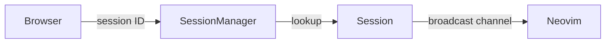
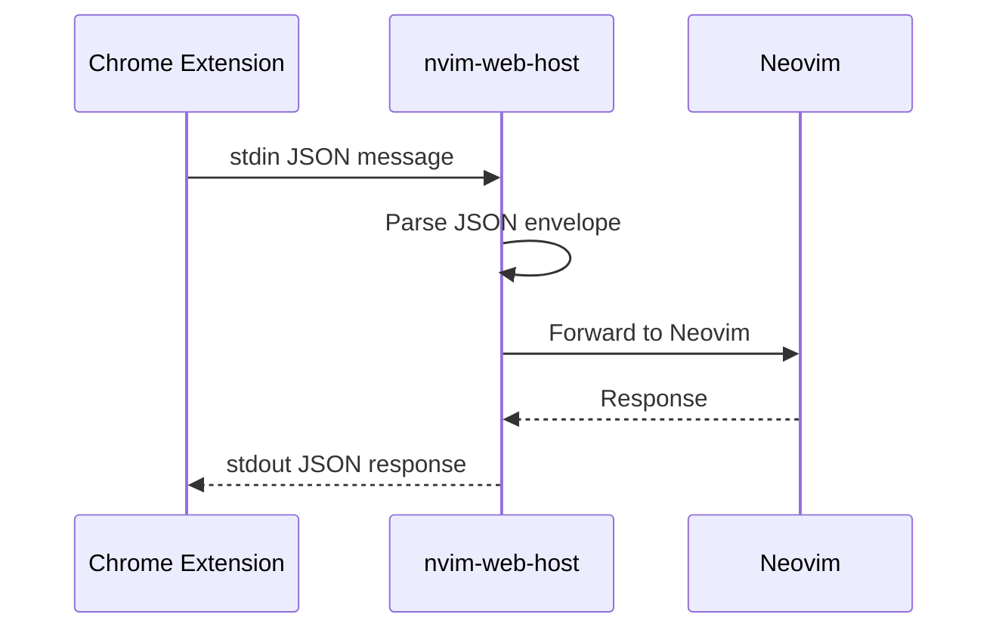

# nvim-web Architecture

## System Overview

nvim-web is a dual-component system that bridges native Neovim to the browser.

See also:
- [Testing Philosophy](./testing.md) — Our test + verify approach
- [Protocol Specification](./protocol.md) — WebSocket message format



## Component Details

### Host (nvim-web-host)



| Module | Responsibility |
|--------|----------------|
| `main.rs` | Entry point, spawns Neovim and starts WS server |
| `ws.rs` | WebSocket handling, connection lifecycle, message routing |
| `rpc.rs` | Neovim RPC protocol (msgpack encoding/decoding) |
| `nvim.rs` | Neovim process management (`nvim --embed`) |
| `vfs/` | Virtual filesystem backends (local, memory, overlay, SSH) |
| `sharing.rs` | Share link management and workspace snapshots |

### UI (nvim-web-ui)



| Module | Responsibility |
|--------|----------------|
| `lib.rs` | WASM entry point, WebSocket, event handlers |
| `renderer.rs` | Canvas 2D rendering, text drawing, cursor |
| `grid.rs` | Grid state (cells, characters, highlights) |
| `highlight.rs` | Syntax highlight attribute storage |

## Message Flow

### Startup Sequence



### Input Handling



## Threading Model



The host uses three threads:

1. **Main Thread**: Sends to WebSocket, writes to Neovim stdin
2. **Neovim Reader**: Reads from Neovim stdout, sends to shared channel
3. **WS Reader**: Reads from WebSocket, sends to channel

The Neovim reader thread persists across browser reconnections (key fix for stability).

## Virtual Filesystem



URLs:
- `vfs://local/path` - Server filesystem
- `vfs://browser/path` - Browser OPFS storage
- `vfs://ssh/user@host/path` - Remote via SSH

## Reconnection Architecture

Browser refresh triggers reconnection without losing Neovim state:



Key: Neovim reader thread persists, channel shared via `Arc<Mutex<>>`.

## Session Management

Sessions persist across browser disconnections via:

1. **URL parameter**: `?session=<id>` - explicit session binding
2. **localStorage**: Automatic session ID storage
3. **Host-side manager**: `AsyncSessionManager` maintains session pool



## Session Sharing & Persistence

Beyond basic persistence, sessions can be shared or snapshot:

### Share Links
- **ReadOnly**: View-only access to a running session
- **Time-limited**: Auto-expiry (e.g., 1 hour)
- **Use-limited**: Maximum number of concurrent viewers

### Snapshots
- Captures state: CWD, open files, cursor positions
- Independent of original session (cloned state)
- Resumable as a new session

## Native Messaging (Chrome Extension)

For direct browser extension integration:



Install native messaging manifest:
```bash
./scripts/install-native-manifest.sh
```

## Security Model

- WebSocket bound to `127.0.0.1` only (localhost)
- Origin validation for allowed origins
- VFS path sandboxing (prevents traversal attacks)
- Session tokens for CLI open commands
